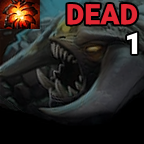
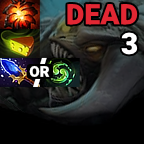
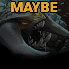
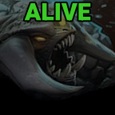

<h1 align="center">Roshan Timer</h1>

A fan-made Stream Deck plugin for Dota 2.

  

## Keep track of Roshan's respawn time and items dropped on death directly from your Stream Deck!
A Stream Deck plugin created using the [StreamDeckToolkit](https://github.com/FritzAndFriends/StreamDeckToolkit) template library.

# How to Use

| Action       | Result                                                      |
|--------------|-------------------------------------------------------------|
| Single Press | Start / Pause / Resume timer                                |
| Long Press   | Restart timer                                               |
| Double Press | Increase Roshan death count (Do this everytime Roshan dies) |

# Downloads
**IMPORTANT NOTE: Links coming soon!**
- Elgato Plugin Store (Recommended)
- Direct Download

# Timer States
## Default

- Timer has not been started. **Press on Roshan's first death to begin the timer.**

## Dead

- Drops `Aegis of the Immortal` on first death
 

- Drops `Aegis of the Immortal` + `Aghanims Shard` on second death
 

- Drops `Aegis of the Immortal` + `Cheese` + (`Refresher Shard` OR `Aghanims Blessing`) on third death
 

- Drops `Aegis of the Immortal` + `Cheese` + `Aghanims Blessing` + `Refresher Shard` on fourth (and above) death

## Maybe

- When the timer is between 8-11 minutes

## Alive

- When the timer has been running for more than 11 minutes

# Contact Us / Support Line
- For inquires related to this specific plugin / repository: `roshan-timer@adrian-miasik.com`
- For inquries related to any of my stream deck plugins: `stream-deck-plugins@adrian-miasik.com`

# Legal
Copyrights and trademarks are the property of their respective owners.
- Adrian Miasik (Logo)
- Dota 2 (Logo)
- Roshan Spell Block (Skill Art)
- Aegis of the Immortal (Item Art)
- Cheese (Item Art)
- Aghanim's Shard (Item Art)
- Aghanim's Blessing (Item Art)
- Refresher Shard (Item Art)
